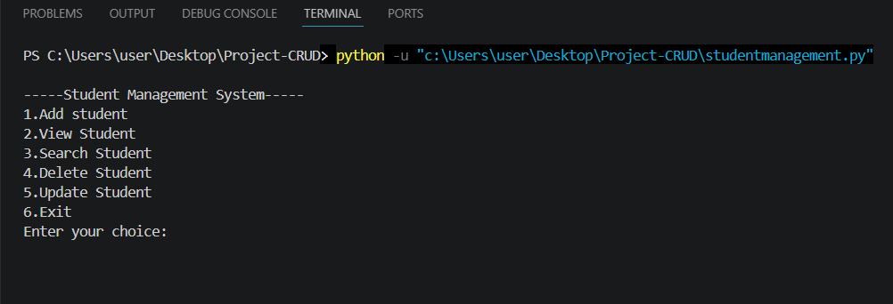
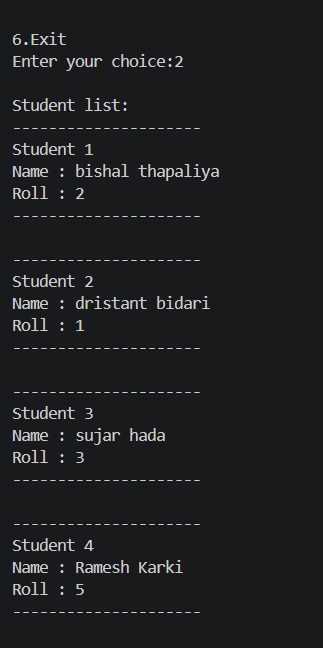
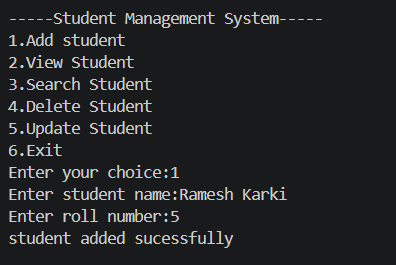
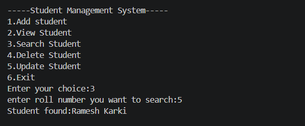
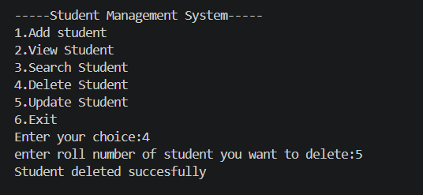

# Student Management System (Python)

A simple command-line Student Management System built using Python and JSON for data storage.

---

## 🎯 Project Goal
This project was built to practice Python fundamentals, file handling, and CRUD operations using a real-world student management system example.

---

## 📌 Features
- Add student details
- View all students
- Search student by roll number
- Update student information
- Delete student record
- Data stored permanently using JSON file
- Input validation for name (letters only,no numbers or special character)
- Input validation for roll number (numbers only)

---

## 🛠️ Technologies Used
- Python
- JSON (file handling)

---

## 🚀 How to Run
1. Clone the repository
2. Open terminal in project folder
3. Run the program:
```
python studentmanagement.py
```

## 📂 Project Structure
- studentmanagement.py → Main program (CRUD logic)
- students.json → Data storage file (JSON database)

---


## 🔄 Recent Updates
- Added input validation to ensure name contains letters only
- Added input validation to ensure roll number contains numbers only
- Students are now displayed in sorted order by roll number
- Empty input checks added across all functions

---

## 🚀 Future Improvements
- Add GUI using Tkinter or PyQt  
- Add database support using SQLite  
- Add login system for admin access  
- Flask web application version (in progress)

---

## 📸 Project Screenshots

### Main Menu


### Student List


### Add Student


### Search Student


### Delete Student
